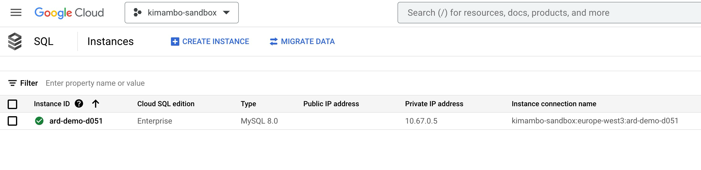
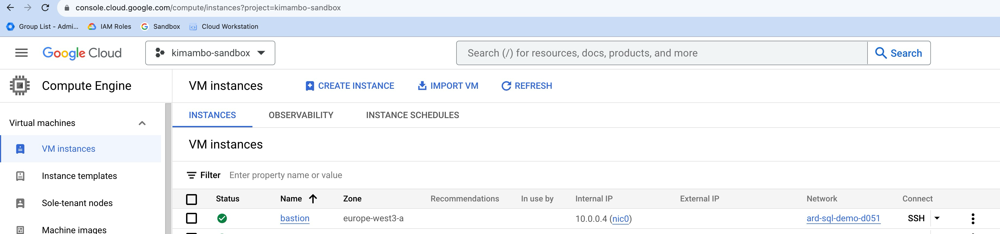
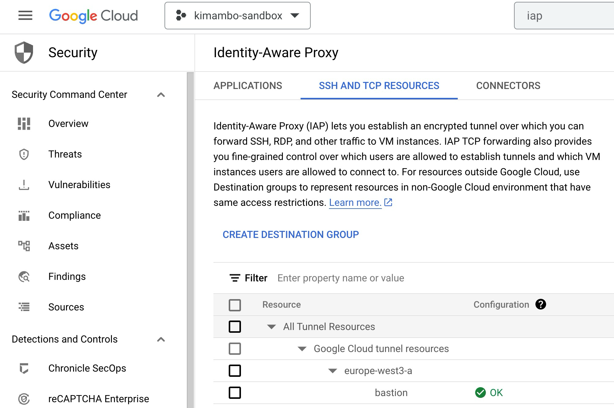
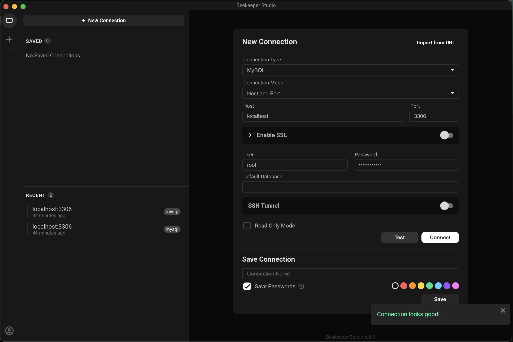

# Establishing a connection to a private Cloud SQL

Here we will describe the process of establishing a connection to a private Cloud SQL instance from a local machine, 
for development or administration purposes. 

## Pre-requisites

    - Cloud Nat is present in the VPC to allow the bastion host to access the internet
    - You have the following tools installed on your local machine
        - Terraform
        - gcloud
        - mysql client
    - Neccessary roles and permission to create the resources
    - A role to access the Cloud SQL instance (cloudsql.instances.connect role)
  
## Architecture

The terraform code in this repository creates the following resources

    - A VPC network
    - A subnet
    - A Cloud SQL instance with private IP
    - A bastion host with a private IP
    - Firewall rules to allow SSH access and mysql client access through Identity Aware Proxy (IAP)
    - VPC peering between the ard-demo VPC and the cloudSQL Google managed VPC

This is the most common setup scenario of accessing CloudSQL. SQL server will be accessible by all hosts in this VPC.

## Steps

1. Clone this repository

2. Initialize terraform providers

    `terraform init --upgrade`

3. Authenticate gcloud

    `gcloud auth application-default login`

    or 

    set the environment variable GOOGLE_APPLICATION_CREDENTIALS to point to a service account key file to be used for installation

4. Create the resources
   
     `terraform apply`

5. Once successfully applied you should see the resources created in the GCP console

    Cloud SQL instance

    
    
    Private Bastion host

   

    Identity Aware Proxy

    

6. Access Bastion Host

   To access bastion host that has no external ip we will need to tunnell the traffic through IAP. 

    `gcloud compute ssh bastion --zone=europe-west3-a --tunnel-through-iap`

7. Find Cloud SQL instance information 
    
    `gcloud sql instances list`

    Get the connection info:    

    `gcloud sql instances describe ard-demo-d051 --format="value(connectionName)"`

    result: 

     `kimambo-sandbox:europe-west3:ard-demo-d051`

8. Start Cloud SQL Proxy

    `cloud_sql_proxy -instances=ard-demo:europe-west3:ard-demo-mysql`

    At this point the bastion host is ready to accept connections and forward them to the Cloud SQL instance
    Test the connection to the Cloud SQL instance from the bastion host. 

    `mysql -h127.0.0.1 --port3306 -u root -p`

    If you are able to connect to the Cloud SQL instance from the bastion host then you are ready to connect from your local machine.

9. Connect from local machine

   To connect from local machine to the bastion host, we shall rely on tunneling capabilities of IAP.

    `gcloud compute start-iap-tunnel bastion 3306 --local-host-port=localhost:3306 --zone=europe-west3-a`

    This creates a tunnel between your local machine and the bastion host, listening on port 3306 on your local machine
    and forwarding that traffic to the bastion host on port 3306 (on which the Cloud SQL proxy is listening)
    Thus creating a tunnel between your local machine and the Cloud SQL instance.

10. Connect to the Cloud SQL instance from your local machine

    `mysql -h127.0.0.1 --port3306 -u root -p`

    You should be able to connect to the Cloud SQL instance from your local machine.

    IAP automatically disconnects sessions after 1 hour of inactivity.
    We recommend having logic in your applications to handle reestablishing a tunnel when it becomes disconnected.

    Here we tested the connection from the local machine using Beekeeper Studio. 

## Advantages of this approach

    - No need to whitelist IP addresses
    - No need to create a VPN connection
    - No need to create a bastion host with external IP
    - The cloud sql proxy can be left running on the bastion host, 
      users who require database access can be granted permissions to access IAP destination to be able to create tunnels.

## Disadvantages of this approach

- IAP disconnects sessions after 1 hour of inactivity, so logic needs to be implemented to handle reestablishing a tunnel when it becomes disconnected.
- IAP tunnels are not meant for big data transfers, so this approach is not suitable for data migration.

## References

- https://cloud.google.com/sql/docs/mysql/connect-instance-private-ip
- https://cloud.google.com/sql/docs/mysql/connect-auth-proxy
- https://cloud.google.com/iap/docs/using-tcp-forwarding